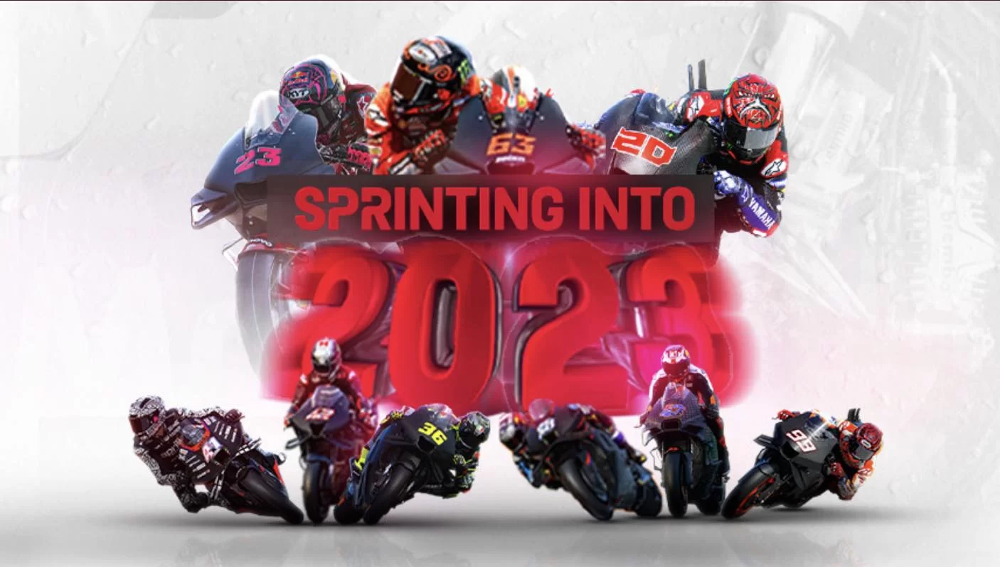

# MotoGP 2023

> MotoGP

🏍 Projeto criado para exercitar HTML, CSS e Javascript 🏍

[🔗 Clique aqui para acessar.](https://danielkistemacher.github.io/MotoGP-2023/)

## 🛠 Tecnologias

- HTML
- CSS
-Javascript
- Git e GitHub

## ⚠ Informações do projeto

- Página inicial contendo: Pilotos, Equipes e Mídia.
- Ao clicar na imagem do piloto é aberto a página com os dados e imagens.
- Ao clicar na imagem da equipe é aberto a página com os pilotos e informações da equipe.
- Ao clicar nas imagens de mídia você será direcionado para a página clicada.

 

- Na página do piloto, além das informações pessoais é possível acessar o Instagram e a página da equipe.
- Na página da equipe, além das informações é possível acessar as páginas dos pilotos.

## ✉ Contato
danielkistemacher@gmail.com